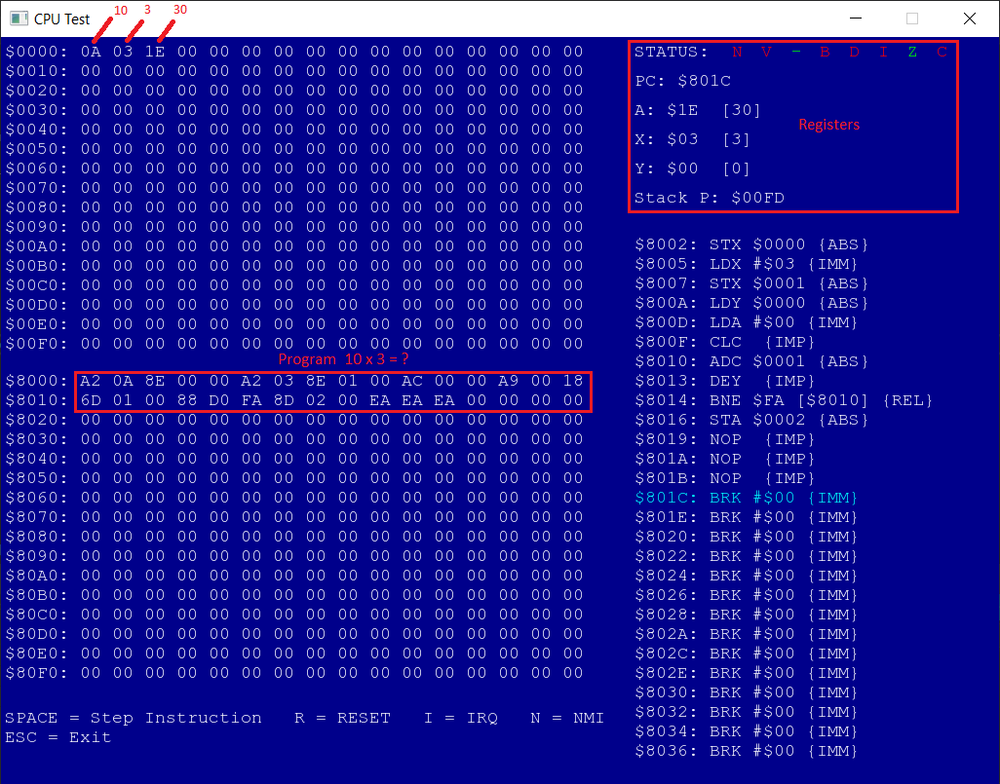

# Nes-6502



Este projeto é um emulador da CPU do Nes, o MOS 6502. Ele permite a execução de programas e jogos escritos para o Nes.

## Descrição

O Nes-6502 é um projeto que permite a execução de programas e jogos escritos para o Nes, além de fornecer uma interface de usuário para a execução de instruções.

## Tecnologias utilizadas

- Visual Studio 2017
- C++ 14.28
- SFML 2.5.1

## Como usar

Para usar o Nes-6502, basta seguir os seguintes passos:

1. Clone o repositório:

```
git clone https://github.com/thiagomorini/Nes-6502.git
```

2. Baixe a bilioteca SFML e referencie ao projeto.

3. Execute o projeto

Já existe um programa de exemplo na memória, onde executa uma multiplicação simples entre dois números (o resultado de 10 x 3).

## Contribuição

Você pode contribuir com o Nes-6502 de várias formas:

1. Reportando bugs e problemas no Github.
2. Fazendo pull requests com correções e novas funcionalidades.
3. Compartilhando o projeto e incentivando outros desenvolvedores a usá-lo.

## Licença
O Nes-6502 é distribuído sob a licença MIT.

## Contato
Você pode entrar em contato comigo sempre que tiver alguma dúvida ou sugestão de melhorias.
